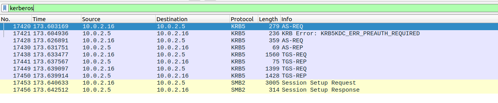
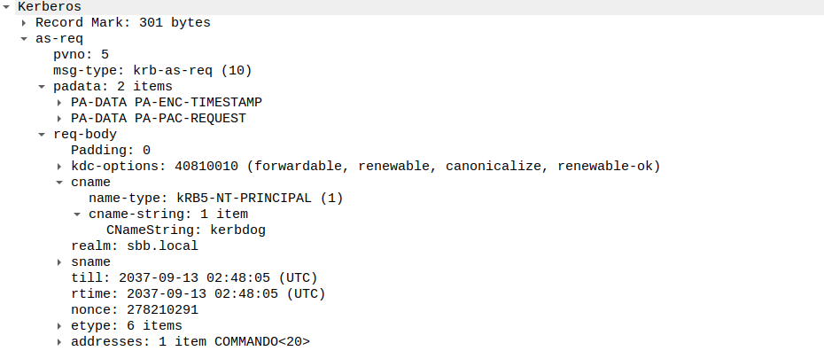
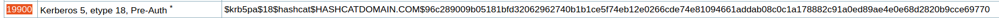
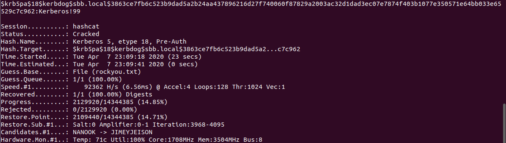

# Hackzone: RexR3xRex Walkthrough

Presentation
------------

During an Active Directory pentest mission, i successfully pwned a user password from this network traffic capture, can you reproduce what I have done and submit the flag in this format : HZVIII{user@domain:password}

Vulnerability
-------------

Kerberos Preauthentication: cracking user password from AS-REQ or AS-REP.
Actually Pre-authentication is the first step first in Kerberos authentication. 

How Preauth works? When requesting a TGT a user encrypts the timestamp with its own password and sends [the PA-DATA](https://tools.ietf.org/html/rfc4120#page-60) (it is part of the AS-REQ). The KDC will attempt to decrypt it and validate that the right password was used and that it is not replaying a previous request.  From there, the TGT will be issued for the user to use for future authentication.

Luckily, preauthentication is required by default in Active Directory.  However, when capturing the network an offline bruteforce of the password is possible.

Write up
-----------

- Analyse the given pcapng and find the kerberos traffic

- Try to understand how the kerberos authentication works
- Find this information in the pcapng: username (CNameString: kerbdog), domain (realm: sbb.local), encryption type (etype: AES '18') and the cipher.

Ps: The cipher can be from the AS-REQ or AS-REP. When cracked, they can both give the user's password.

- if using the cipher from AS-REQ 

- Now you now that the hashcat hash format must be like: $krb5pa$18$username$domain$cipher
- If hascat did not work, search a beta version of it (https://hashcat.net/beta/) with the wordlist that rocks :D

Distribution
-------------
https://drive.google.com/open?id=1Yb_ipMIh1tCXytWApILBreIp5q8NXeML

Flag
----------

`HZVIII{kerbdog@sbb.local:Kerberos!99}`

References
----------

-https://www.harmj0y.net/blog/activedirectory/roasting-as-reps/
- https://ldapwiki.com/wiki/Kerberos%20Pre-Authentication

