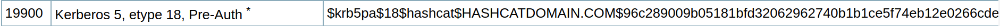

## Hackzone: RexR3xRex Walkthrough

Investigate-Me
==============

Presentation
------------

During an Active Directory pentest mission, i successfully pwned a user password from this network traffic capture, can you reproduce what I have done and submit the flag in this format : HZVIII{user@domain:password}

Vulnerability
-------------

Kerberos Preauthentication

Write up
-----------

- Analyse the given pcapng and find the kerberos traffic

- Try to understand how the kerberos authentication works
- Find this information in the pcapng: username (CNameString: kerbdog), domain (realm: sbb.local), encryption type (etype: AES '18') and the cipher.

- Use your google Fu and the etype from the previous step to find out how to decrypt the cipher: 

- Now you now that the hashcat hash format must be like: $krb5pa$18$username$domain$cipher
- If hascat did not work, search a beta version of it (https://hashcat.net/beta/) with the wordlist that rocks :D

Distribution
-------------
https://drive.google.com/open?id=1Yb_ipMIh1tCXytWApILBreIp5q8NXeML

Flag
----------

`HZVIII{kerbdog@sbb.local:Kerberos!99}`

References
----------

- https://ldapwiki.com/wiki/Kerberos%20Pre-Authentication

